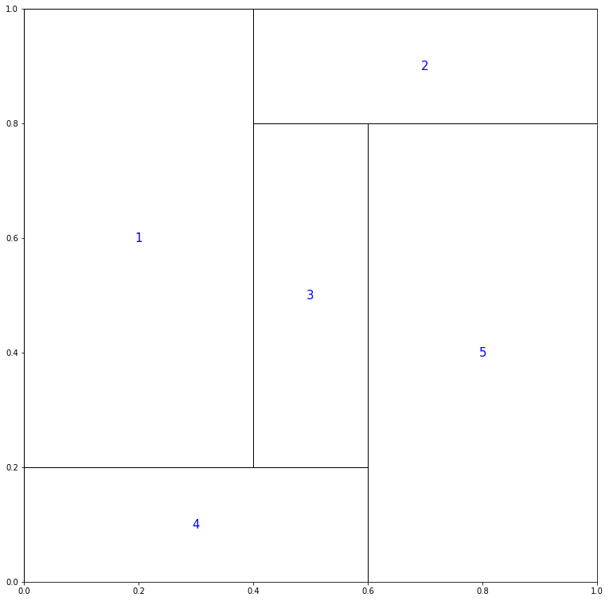
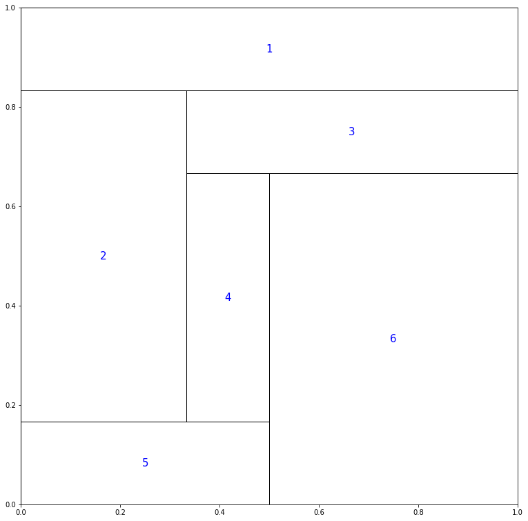
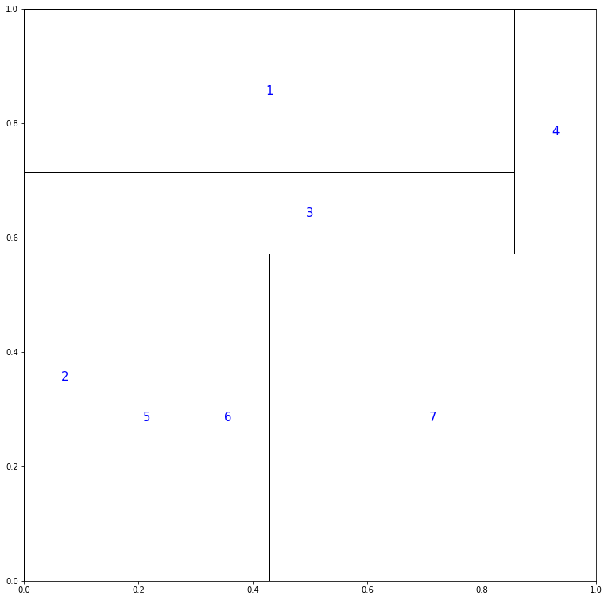
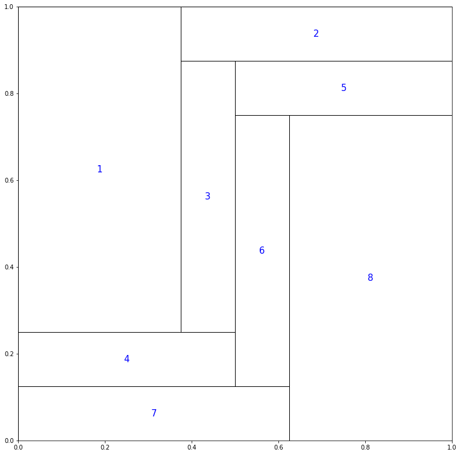
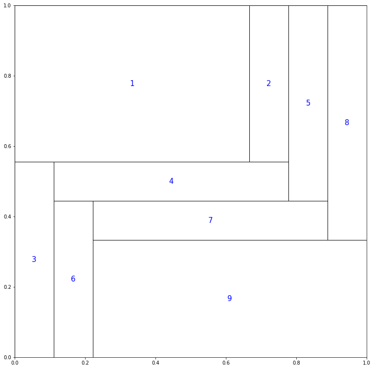
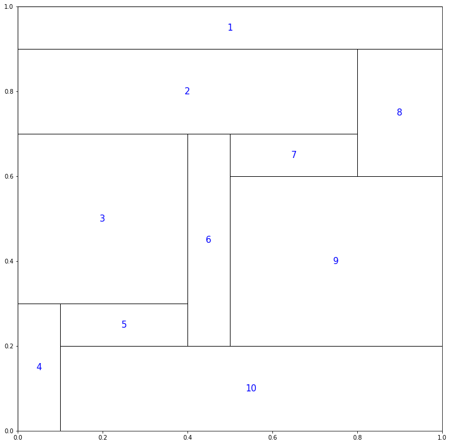
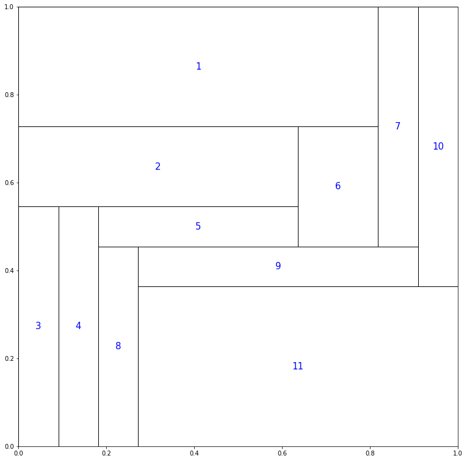
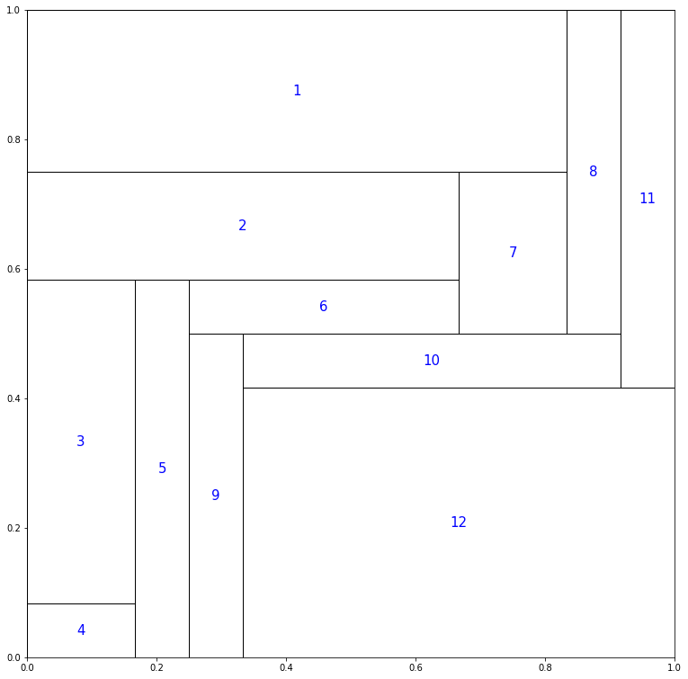

# Optimal Gullotine cuts

#### This file keep tracks of baxter permutations that requires maximum costs

### Remark:
1. For 5 <= n <= 12: We run on

   ```
	  Processor Name: Intel Core i5
	  Processor Speed: 1.8 GHz
	  Number of Processors:	1
	  Total Number of Cores: 2
	```

##### Cases:

1. n <= 4

   	```
	All baxter permutations are separable
	```

2. n = 5

	```
	Time taken for Enumeration 606.956µs
	Time taken for OCS 1.105878ms
	Perm:  [4 1 3 5 2]
	Cost:  1
	```

	

3. n = 6

   ```
   Time taken for Enumeration 1.106053ms
	Time taken for OCS 1.211845ms
	Perm:  [5 2 4 6 3 1]
	Cost:  1
   ```

   

4. n = 7

   ```
   Time taken for Enumeration 15.419867ms
	Time taken for OCS 15.692806ms
	Perm:  [2 5 6 7 3 1 4]
	Cost:  1
   ```

   

5. n = 8

   ```
   Time taken for Enumeration 43.29807ms
	Time taken for OCS 46.344219ms
	Perm:  [7 4 1 3 6 8 5 2]
	Cost:  2
   ```

   

6. n = 9

   ```
   Time taken for Enumeration 99.454825ms
	Time taken for OCS 215.063087ms
	Perm:  [3 6 9 7 4 1 2 5 8]
	Cost:  2
   ```

   

7. n = 10

   ```
   Time taken for Enumeration 248.414957ms
	Time taken for OCS 1.156025455s
	Perm:  [4 10 5 3 6 9 7 2 8 1]
	Cost:  2
   ```

   

8. n = 11

   ```
   Time taken for Enumeration 1.371572595s
	Time taken for OCS 9.455975751s
	Perm:  [3 4 8 11 9 5 2 6 1 7 10]
	Cost:  3
   ```

   

9. n = 12

	```
	Time taken for Enumeration 9.305966878s
	Time taken for OCS 1m5.445024497s
	Perm:  [4 3 5 9 12 10 6 2 7 1 8 11]
	Cost:  3
	```

	
